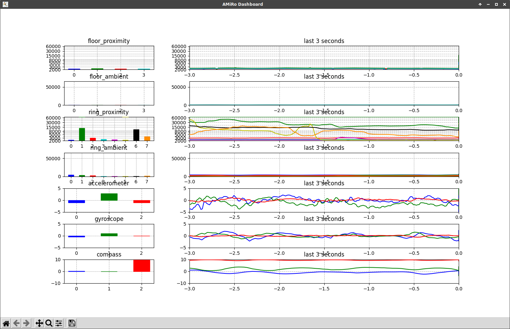

# amiro-remote - Interact with an AMiRo remotely

**amiro-remote** is a Python package providing methods to remotely communicate with an AMiRo by connecting with the ESP module over wifi. The ESP module forwards the CAN traffic and writes onto the CAN when recieving messages from remote clients. This package exposes the C-definitions of Topics and Services in Python to collect sensor data and request services. The definitions of Topics, Services and other structs, located in `src/amiro_remote/amiro.py`, are meant to be adapted and extended to the mirror those of the corresponding AMiRo-Apps version.

# Installation

Python 3.7 or newer is required.

You can install `amiro-remote` via pip:

```
$ pip install git+https://gitlab.ub.uni-bielefeld.de/ks-nano/amiro/hardware/espamiro.git@main#egg=amiro-remote&subdirectory=Clients/amiro-remote
```

If you want to adapt `amiro.py` to your custom AMiRo-Apps version, you can clone `amiro-remote` and install it in editable mode:

```console
$ git clone -b main https://gitlab.ub.uni-bielefeld.de/ks-nano/amiro/hardware/espamiro.git
$ cd espamiro/Clients/amiro-remote
$ pip install -e .
```

The resulting folder structure should look like this: 
```
amiro-remote
└── docs
└── src
│   └── amiro_remote            
│   │   │   __init.py__         
│   │   │   amiro.py            # Contains all static definitions mirroring AMiRo-Apps
│   │   │   can.py              # Read and write CAN messages from the ESP module synchronously
│   │   │   cli.py              # Provides basic command line tools for interaction
│   │   │   client.py           # Non-blocking client recieving data in background thread
│   │   │   plotting.py         # Plot AMiRo sensor data
│   │   │   util.py             # Utility functions
└── test
└── esp.txt
└── LICENSE.txt
└── README.md
└── setup.py
```

# Usage 

## Monitor topic data from CAN

To monitor the CAN traffic and receive the published Topic data in the most simple way, the `CANReaderWriter` object can be used. The following example prints the topic data as they come, while blocking during the `crw.get()` calls. 
```python
from amiro_remote.can import CANReaderWriter

with CANReaderWriter("129.70.147.164", 1234) as crw:
    while(True):
        topic_data = crw.get()
        print(topic_data)
```
Pythons context manager syntax is a shortcut for calling `crw.connect()` and `crw.disconnect()`.

When connected, it is also possible to transmit a service request to the AMiRo. The following statement sets the light ring color to green.
```python
crw._send_service(Service.Light, [LightRingColor.Green])
```

## Non-blocking remote client

While the previous approach requires you to retreive the topic data immediately, the `AmiroRemoteClient` handles all CAN communication in a seperate background thread. This allows for a more convenient integration of the AMiRo remote functionality into other applications and is also suitable for the Python interactive console. 

The following demo sets the rotation to 1 while switching through some colors for one second each. In the end, the latest ring proximity values are printed.
```python
from amiro_remote.client import AmiroRemoteClient
from amiro_remote.amiro import LightRingColor

with AmiroRemoteClient("129.70.147.164", 1234) as arc:
    arc.set_motor(0, 1)

    for color in [LightRingColor.Cyan, LightRingColor.Green, LightRingColor.Red]:
        arc.set_light(color)
        sleep(1)
    
    print(arc.latest[Topic.RingProximity])

    arc.set_light(0)
    arc.set_motor(0, 0)
```

Besides accessing the latest values of each topic, the list of all received topic data can be collected in chronological order by the main thread:
```python
arc.collect_data(topic=Topic.Accelerometer)
```
If no specific topic is provided, the list all topic data is returned.

## CLI

In addition to the python interface, a command line interface is available after installation. 

It is possible to set the light to cyan:
```console
$ amiro-remote 129.70.147.206 light cyan
```

As well as the translation to 0 and the rotation to 1:
```console
$ amiro-remote 129.70.147.206 motor 0 1
```

To inspect the published sensor data from the AMiRo, you can start dashboard that visualizes the incoming topics in a separate window:
```console
$ amiro-remote 129.70.147.206 dashboard
```
