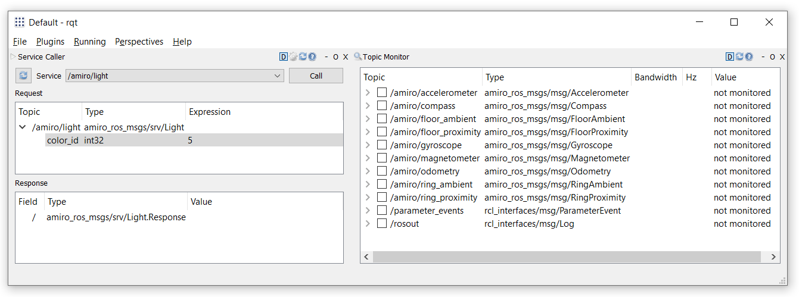

# ROS 2 AMiRo Interface

This workspace contains all packages related to the ROS 2 AMiRo interface, located in `src/`: 
- amiro_ros: Contains the main amiro-node
- amiro_ros_msgs: Contains messages and services that node uses
- teleop_tools: Teleop package for remote control of the motor

## Prerequisites

To run the packages, you have to:

- Install ROS 2 Foxy
- Install the amiro-remote Python package that is located in `Clients/amiro-remote` with your ros python installation
- Build packages (amiro_ros requires amiro_ros_msgs)

For further instructions on how to build packages and source the workspace, visit the ROS 2 Foxy docs: https://docs.ros.org/en/foxy/Tutorials/Beginner-Client-Libraries.html

## Run the AMiRo node

After building the packages, you have to source the workspace in order to run the amiro node you just built. When running the node, you need to specify the ip of the AMiRo as a ros parameter:
```console
$ ros2 run amiro_ros amiro --ros-args -p ip:="129.70.147.76"
```

If everything works fine, the output should look similar to this:
```console
[INFO] [1671547888.689489200] [amiro]: Initialize node
[INFO] [1671547888.831472000] [amiro]: Connecting to ('129.70.147.76', 1234)...
[INFO] [1671547888.838180500] [amiro]: Successfully connected to ('129.70.147.76', 1234)
```

To inspect the node, source your workspace in another console and start `rqt`, which should come with your ROS 2 installation. Within `rqt`, you can have a look at all topics and their types, as well as play around with the services:


When inspecting the node with `rqt`, you can see that the node publishes all sensor data under `/amiro/XYZ` as ros topics. For example, the ring proximity values are published under `/amiro/ring_proximity`. Similarly, the motor request is available under `/amiro/dmc_target`.

Whenever the node receives a request, it logs it via the console:
```console
[INFO] [1671548596.106244100] [amiro]: Got Request amiro_ros_msgs.srv.Light_Request(color_id=5)
```

## 
